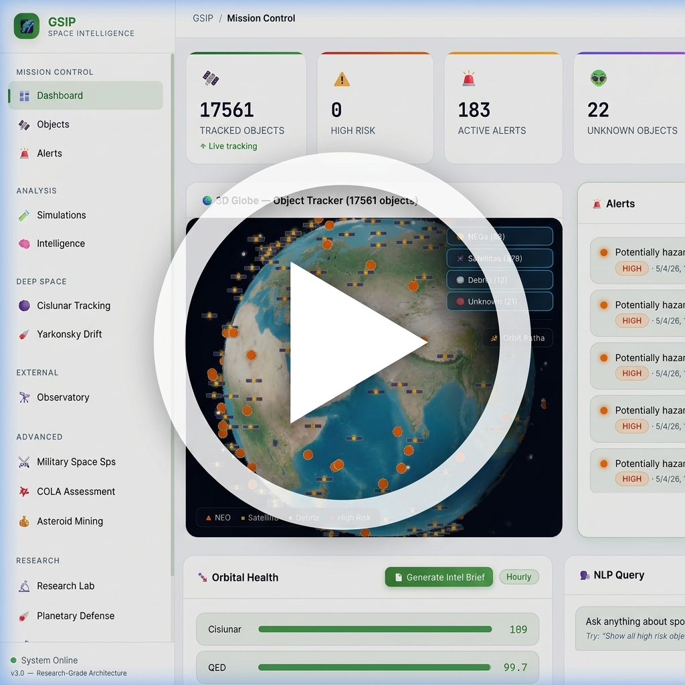

# 🌌 GSIP — Global Space Intelligence Platform

  

---

## 🔒 Restricted Access Notice
**The source code for GSIP is proprietary and currently hosted in a private repository.** 

This repository serves as a public showcase of the platform's capabilities, architecture, and research-grade features. If you are interested in a full demonstration, technical collaboration, or licensing the software, please reach out directly:

*   **📧 Email**: [parthiv88@gmail.com](mailto:parthiv88@gmail.com)
*   **🔗 LinkedIn**: [linkedin.com/in/parthiv88](https://www.linkedin.com/in/parthiv88)

---

## 🎯 Platform Overview
A production-grade, queue-less, high-performance Space Domain Awareness (SDA) platform. GSIP is designed for military, commercial, and scientific space organizations to ingest real telemetry and run advanced physics and ML models locally, without reliance on cloud processing.

### 🔬 Core Intelligence Features
*   **NEO Tracking & Live Alerts**: Real data ingestion from NASA NeoWs, NOAA, and Space-Track.
*   **Behavioral Fingerprinting (ML)**: Anomalous maneuver detection using unsupervised machine learning.
*   **Kessler Cascade Simulator**: Modeling orbital debris chain reactions using the NASA Breakup Model.
*   **Asteroid Mining Valuation**: Spectral analysis and ROI calculation for NEO resource prospecting.
*   **Dark Fleet / RPO Detector**: Identifying non-cooperative "inspector" satellites and shadowing operations.

### 🧪 Research-Grade Capabilities
*   **Satellite Intent Recognition**: ML-based classification of non-cooperative object behavior.
*   **Neuromorphic Event Tracking**: Software simulation of sub-pixel localization for asynchronous brightness changes.
*   **Micro-Doppler Characterization**: Extracting rotation and shape parameters from radar signatures.
*   **Orbital Game Theory**: Modeling nation-state interactions and escalation outcomes.

---

## 🌐 About Us

**GSIP** was born out of a mission to democratize research-grade Space Domain Awareness (SDA). We believe that high-fidelity orbital intelligence should be accessible to more than just a few world powers. 

Our platform is built by a distributed team of aerospace engineers, data scientists, and software architects dedicated to bridging the gap between academic orbital mechanics research and production-ready monitoring tools. GSIP is 100% cloud-independent, ensuring that critical space intelligence remains operational even in the most restricted or disconnected environments.

---

## 🛠️ Architecture Stack
*   **Frontend**: Angular 17 + CesiumJS
*   **API Gateway**: .NET 8 (C#)
*   **Compute Engine**: Python 3.11 (Physics & ML)
*   **Database**: PostgreSQL 16
